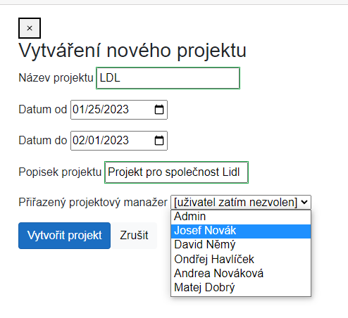

# KIV/PIA - Management Tool Project 2022

This is a brief description of my result for this assignment.
It walks you through how to compile the whole project and how to get it up and running. 
The entire description of the assignment can be found over at Teams.
Don't panic, the UI is in czech language because it was specified in the assignment. 
Unfortunately I didnt make any localizations. 
Although this assignment is long overdue I hope it is good enough to get needed points.


## System + Architecture

System was written in `C#` language with <b>Blazor</b> web framework and <b>ASP.NET</b> for development of Web API. 
Namely the current system frontent is using <b>Blazor WebAssembly</b>.
For the purpose of easy deployment all the system components are published into  <b>docker</b> containers. 


As was mentioned earlier this system is contained of <b>Single Paged Application</b> (SPA) thin client which 
communicates and gets all data from <b>Web API</b> and a <b>Postgresql</b> database. The whole system can be then split into three layers. 
The client and API controllers are part of <b>Presentation layer</b> using only presentation models defined in `ManagementTool.Shared`. 
When the client calls one of the API endpoints, then the specified controller calls methods from services (<b>Business Logic layer</b>).
These services similiarly use only business models that are isolated from the client in `ManagementTool.Server`. 
These models are mapper by <b>AutoMapper</b>. 
Services then get data from repositories which only use <b>Data Access layer</b> models (they are also mapped by the <b>Automapper</b>).
Repositories then use <b>Entity Framework</b> queries to get data from database.

The user identity is stored in sessions on server-side. 
The client asks the API for current logged in user and if there is any, it returns needed information so that the frontent 
can show pages to the user based on his permissions.


Naming conventions of classes, interfaces and enums were taken from Microsoft standards:
 https://learn.microsoft.com/en-us/dotnet/standard/design-guidelines/names-of-classes-structs-and-interfaces


## Application setup

Required software for deployment is installed and running software: `docker`

Then all you're required to setup the application is to execute the following command in the root folder of the project structure:

```
docker-compose up --build
```

Assuming you don't have any docker images previously downloaded, it will go ahead and pull down 3 docker images 
needed for starting the appropriate containers. All the images are defined in the `docker-compose.yml` file located
in the root folder of the project. These images will be created:

- `db` my posgresql database
- `managementtool.server` image for the server part of the system
- `managementtool.client` image for the thin client

These three servers are sitting on the same subnet which was created within `Docker`.
However, I needed to expose a few ports to the local machine, so we can interact with the application
effortlessly using a web browser.

The application can be accessed on http://127.0.0.1:5180. Database runs on port :5432


### Deployment outside of docker

It is also possible to run the application outside of docker but it requires the <b>.NET 6.0 SDK</b> installed on the computer.
But if you have the prerequisites you can simply call these commands:

##### Client

`dotnet restore ManagementTool/Client/ManagementTool.Client.csproj`

`dotnet build -c Release -o /build`

`dotnet publish -c Release -o /publish`

`dotnet run ManagementTool.Client.dll`


##### Server

`dotnet restore ManagementTool/Server/ManagementTool.Server.csproj`

`dotnet build -c Release -o /build`

`dotnet publish ManagementTool/Server/ManagementTool.Server.csproj -c Release -o /publish`

`dotnet run ManagementTool.Server.dll`

Part of this project is also a <b>Visual Studio </b>solution  (`.sln`) so you can simply load it in and start/debug in no time.


### Application configuration

Sometimes the change of API or database address needs to be done. 

To change the API server address go to `ManagementTool\Client\wwwroot\`.
There you can find `appsettings.json` where you need to change `ApiBaseUrl` (`appsettings.Development.json` for development configuration).

Database connection string can be changed under `ManagementTool\Server\` again in file `appsettings.json` where you can find `DBPosgreSQL`.
Needed format of the connection string can found [here](https://www.connectionstrings.com/postgresql/).


#### Testing the application on localhost

The client application itself is running over at http://127.0.0.1:5180. 
The database server has its default port `5432` exposed to the local machine as well. 
So, it can be accessed using a database client such as `DBeaver`, for instance. 
The credentials can be found in `docker-compose.yml`


##### Default user accounts

Here you can see list of all users with their credentials:

| Username | Password | Roles |
| :---: | :---: | :---: |
| admin | Abc12345  | All main roles
| depMan1 | Abc12345  | Departman manager
| sup1 | Abc12345  | Superior
| sup2 | Abc12345  | Superior
| secrt | Abc12345 | Secretariat


You maybe wonder why there is no project manager role. 
It is because there is no project for which a project role could be created.
If you want a project manager role follow user manual.


### User module unit tests 

The business logic of user + login module is tested with unit tests which are located inside subproject `ManagementTool.ServerTests`. 
<b>Nunit</b> and <b>Moq</b> framework were used for the purpose of testing.
 The total code coverage can be found under folder `.\TestResults\`.


## Optional functional requirements done

I've decided to pull off the following features:

- SPA + WS API architecture [+10p]
- Detailed maintenance guide [+2p] for installation and standard/regular maintenance task
- Detailed user guide [+2p] with screenshots for the main use-cases 


#### Features added of my own
- Passwords are hashed with <b>SHA256</b> standard, random salt is saved with user in database in `base64` format and is used during user login. 
- Passwords need to have atleast 8 characters containing atlest one upercase, one lowercase and one number 
- Although not explicitly specified in the Teams assignment you can delete users and delete created assignment. Projects cant be deleted.
- Every input form is validated via Data anotations and that means the user instatly gets what is wrong. 

### Github

Full repository can be found on address https://github.com/Pultak/ManagementTool.PIA


### Issues

Although original intention was to access data from client running in different container my custom made authentication method is not compatible with that.
Session is not kept when running outside of the container. 
The possible solution is to include JWT token authentication with correctly configured CORS inside of `Program.cs`.
Unfortunately there is not enough time for me to change that at the moment.


Another issue is in database where init data in the `db-init.sql` fills the database with needed data,
 but doesnt increment the serial counter for ids. So every time I insert a new entry an exception is thrown.
I've tried to set the start index or set it in entity framework to ignore id variable for new object but it was not working.
Temporary hotfix is to set the init data indexes high enough so it wont be triggered. Not a clean solution but i works.


## User manual


### User creation + management

User management module can be found under `Sekretariát` in left navigation bar. 
This page can be accessed only if you have secreatariat rights.


Upon navigating to the page you can see list of all users currently registered. 
There are two buttons you can choose of. 
One is to add to new users to the list and second one is to edit new users.
Both buttons get you to the same page but one is filled with data of the selected user and other is empty.


###### New user creation


If you fill invalid data under user creation and edit page you will be notified by following messages:


For newly created user we have generated password showed in modal dialog.


###### User edit


You can also delete already existing user but you will be asked first.


### Project creation + management

Project management module can be found on multiple places 





### Assignment creation + management


